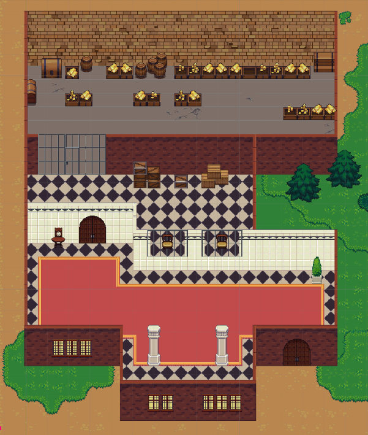
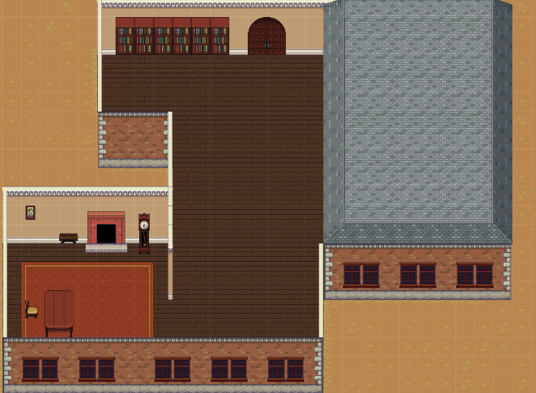
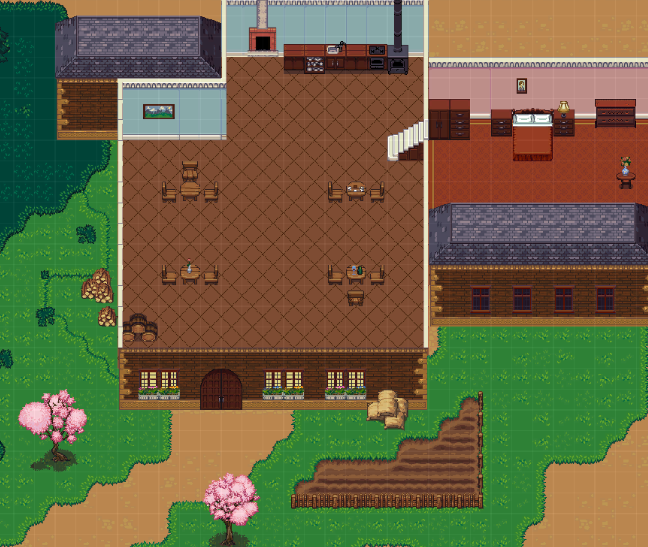
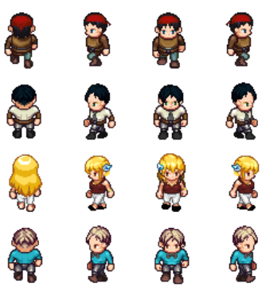
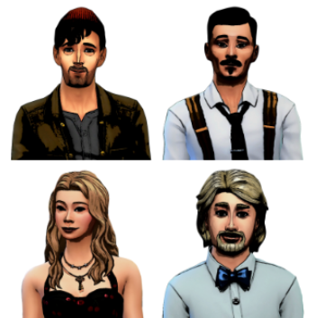
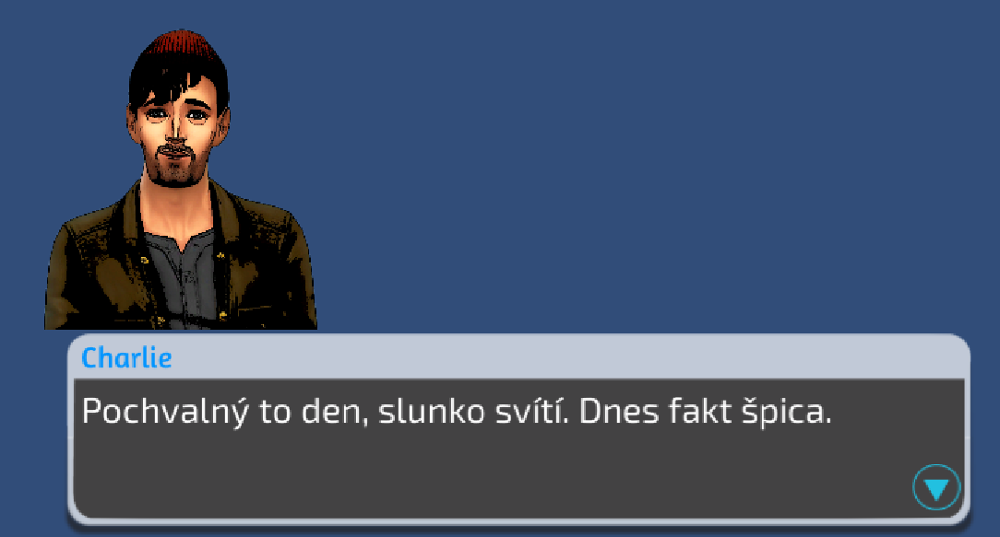
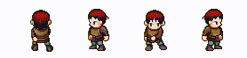
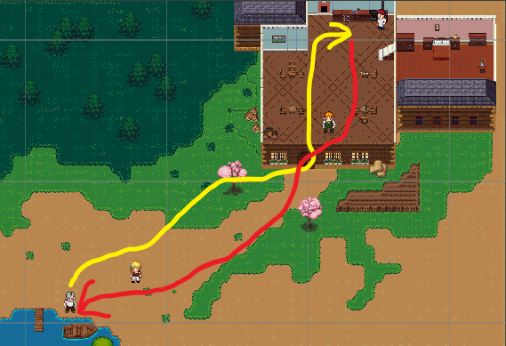
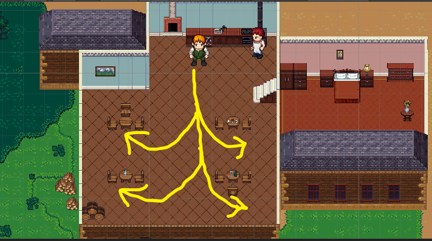
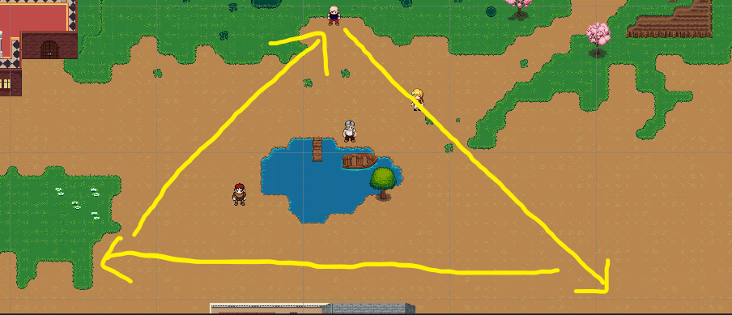

# VHS_game
Repozitář se hrou vytvořenou v rámci bředmětu BI-VHS na FIT ČVUT. 

Hra byla tvořena jako týmový projekt a je vytvořena v enginu Unity. Cílem bylo vyzkoušet si navrhnout nějaký dynamický herní svět, kde jsou NPC které se nějak chovají, dá se s nimi interagovat a 
vymyslet jednoduchý příběh.

# Statický svět

Hra se začala utvářet kolem příběhu a pro tento příběh byly vytvořeny scény s objekty a postavami.

## Scény 
Byly vytvořeny scény, ve kterých se bude odehrávat začátek příběhu. Jedná se o banku, kancelář a restauraci.

Příklady krajinných objektů:
- balíky sena
- stromy
- zem (tráva, tmavší tráva, písek, záhonek, voda)

### Banka
Příklady objektů:
- zlato
- krabice
- hodiny
- sudy
- sloup

### Kancelar
Příklady objektů:
- knihovna
- obraz
- stůl
- krb
- koberec

### Restaurace
Příklady objektů:
- lampa
- postel
- květiny
- krb
- umyvadlo

## Dynamické objekty
Byly vytvořeny 4 postavy, které jsou dynamickými objekty - mohou se pohybovat. Jedná se o postavy, důležité pro příběh. Pro tyto postavy byly vypracovány a avatary, které budou zobrazeny u dialogů.

### Postavy

### Avatary k postavám

### Ukázka dialogu (v tomto případě monologu)

## Zdroj assetů

Odkazy na assety lze dohledat v následujícím dokumentu: https://docs.google.com/document/d/1SDCFm7Y3P5sCd-yiooQf_u0HExDKepfOwGlUJivuU-c/edit

# Dynamický svět

Následující dokument popisuje přidání dynamiky do vytvořeného herního světa.

## Animace pohybu
- Každá postava má animace pohybu a rozlišuje mezi stavy chození / stání
- **Rváč** se navíc pere.
- **Charlie** se navíc pere.
  - 
  

## Cyklické činnosti - hotové:
- **Enrico Marino - rybář**
  - Chytá ryby -> Jde do restaurace -> prodá ryby -> vrátí se k jezeru -> Chytá ryby
  - -  
- **Číšník**
 - Čeká, až kuchař uvaří jídlo -> odnese jídlo ke stolu, který je právě na řadě -> vrátí se do kuchyně
 -  
  
- **Rváč**
    - Chodí dokola po mapě, chce se prát
    -  
  

  
## Produkce - hotová
- **Enrico Marino - rybář**
  - Ryby -> maso(suroviny) - rybář za 7.5 vteřiny uloví 5 ryb, které odnese do restaurace
- **Kuchař**
    - suroviny -> jídlo - kuchař potřebuje k vytvoření jídla 3 jakékoli suroviny. Když je má k dispozici, tak každých 5 vteřin uvaří jídlo
- **Číšník**
    - spotřebovává jídlo. Kdykoli je uvařené jídlo, odnese ho k jednomu ze stolů (kde zatím chybí hosté)

## Chování
- **Rváči**
  - Když s ním hráč interaguje, tak ho začne slovně napadat a konflikt může vyústit až v souboj
   - Je-li poražen, tak zemře a za chvíli zmizí z mapy

## Unikáty
- **Daisy - reakce na vraždu**
    -Pokud hráč bude ignorovat hlavní úkol, místo toho se pustí do souboje s rváčem a zabije ho blízko Daisy, ta si toho všimne a bude reagovat.

